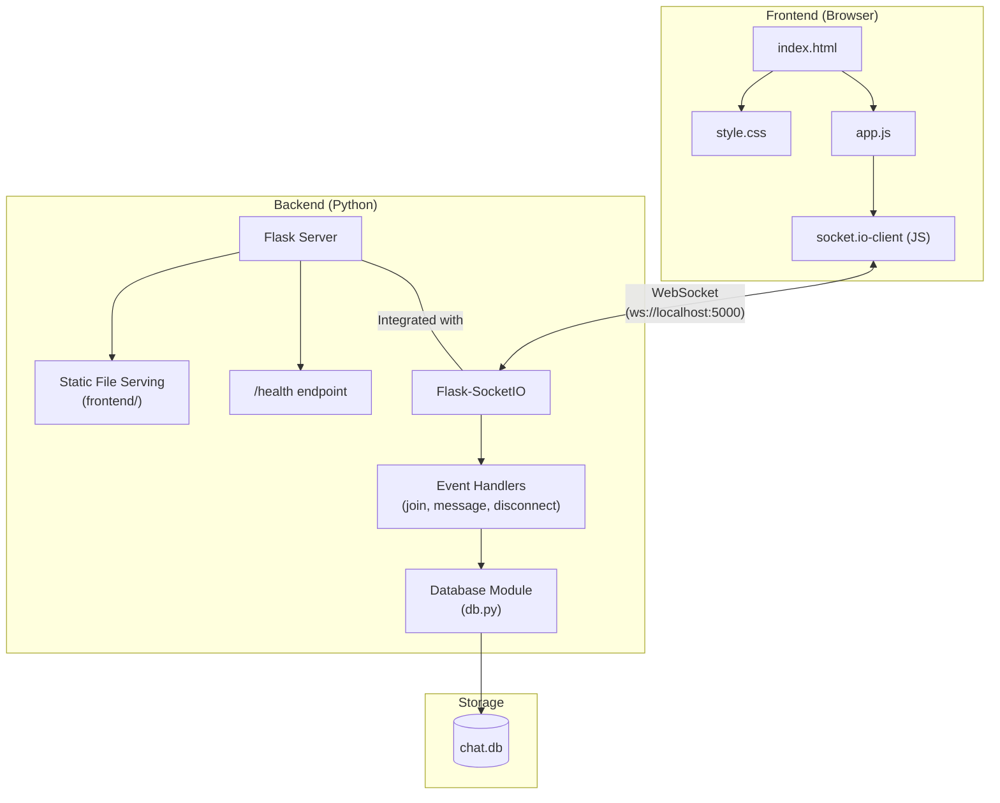
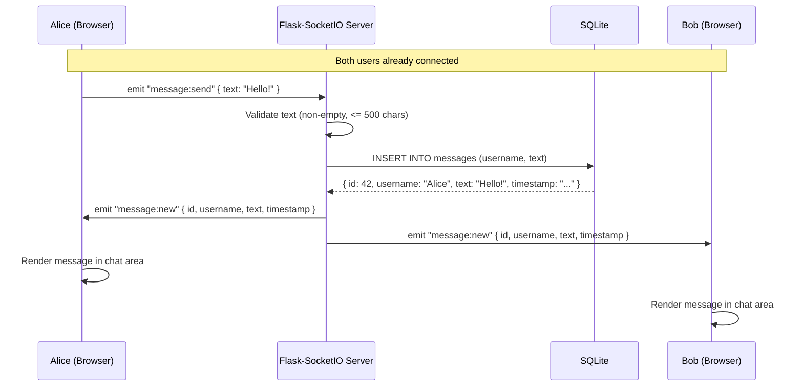
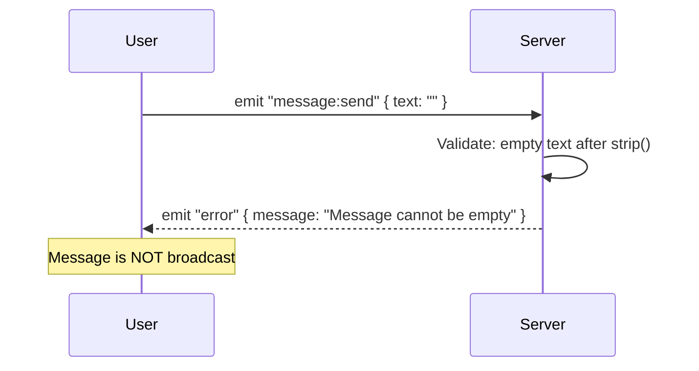

# Architecture Documentation

This document describes how the system is built, justifies technology choices, and addresses cross-cutting concerns. It traces to the [functional specification](functional-spec.md) and [requirements](requirements.md).

---

## Technology Stack

| Layer | Choice | Justification |
|-------|--------|---------------|
| Runtime | Python 3.x | Readable, widely taught, built-in SQLite support. Ideal for a capstone demonstrating engineering process. (A-09) |
| HTTP Framework | Flask | Lightweight, minimal boilerplate. Serves static files and REST endpoints with minimal setup. |
| WebSocket | Flask-SocketIO | Integrates directly with Flask. Supports real-time bidirectional events over WebSockets. (A-11) |
| Database | SQLite (built-in `sqlite3`) | Zero-configuration, file-based, included in Python's standard library. No native module builds. (A-10) |
| Frontend | Vanilla HTML/CSS/JS | No build toolchain needed. The UI is a single page with one form and two lists. (A-14) |
| Testing | pytest + python-socketio client | pytest is the standard Python testing framework. python-socketio provides a client for WebSocket event testing. |

### Decision: Python vs Node.js

Python was chosen over Node.js because:
1. Built-in SQLite support (no native module compilation issues on Windows)
2. Simpler, more readable code for a capstone evaluation
3. Flask-SocketIO provides the same real-time capabilities as Socket.io for Node.js

### Decision: Vanilla JS vs React (Frontend)

The frontend consists of one page with three sections (message list, user list, input form). A framework like React adds a build step, JSX compilation, and component lifecycle management. For this scope, vanilla JS with `textContent` for safe DOM updates is simpler and easier for evaluators to review. This traces to A-14 (single developer) and A-01 (small, simple UI).

---

## Component Architecture



## Directory Structure

```
CapstoneProject/
├── backend/
│   ├── app.py             # Flask + Flask-SocketIO server, event handlers
│   ├── db.py              # SQLite initialization, message CRUD functions
│   └── requirements.txt   # Python dependencies
├── frontend/
│   ├── index.html         # Single-page chat UI with name modal
│   ├── style.css          # Layout and styling
│   └── app.js             # Socket.io client, DOM manipulation
├── tests/
│   ├── test_db.py         # Unit tests for database module
│   ├── test_server.py     # Integration tests for server + Socket.io events
│   └── conftest.py        # pytest fixtures (test DB, test client)
├── docs/                  # All documentation artifacts
├── README.md              # Setup and run instructions
└── .gitignore             # __pycache__, *.db, venv/
```

---

## Sequence Diagrams

### Full Message Lifecycle



### Error Path: Invalid Input



---

## Security Considerations

| Concern | Mitigation | Traces To |
|---------|-----------|-----------|
| **XSS (Cross-Site Scripting)** | All user-provided content rendered using `textContent` in the frontend (not `innerHTML`). HTML special characters are never interpreted as markup. | FR-03, FR-07 |
| **Input validation** | Server validates all inputs (name: 1-30 chars, message: 1-500 chars). Invalid inputs are rejected before processing. | FR-01, FR-03 |
| **SQL Injection** | All database queries use parameterized queries (`?` placeholders), never string concatenation. | FR-05 |
| **No authentication** | Acknowledged trade-off per A-04. For a small internal team, display-name identification is sufficient. Production would require proper auth. | A-04, A-15 |
| **No HTTPS** | Local development only (A-13). Production deployment would require TLS termination. | A-13 |

---

## Scalability Discussion

### Current Design (sufficient for capstone)

- Single Python process with eventlet/gevent for async WebSocket handling
- SQLite with WAL mode for concurrent reads
- In-memory user tracking (dictionary)
- Designed for 2-20 concurrent users

### How to Scale (future considerations)

| Bottleneck | Solution |
|-----------|----------|
| Single process limit | Deploy multiple instances with gunicorn workers behind a load balancer |
| In-memory user state | Move to Redis for shared state across instances |
| SQLite write contention | Migrate to PostgreSQL |
| WebSocket routing | Use Redis message queue for Flask-SocketIO to broadcast across instances |
| Static file serving | Move frontend to a CDN or Azure Static Web Apps |

---

## Risk Register

| ID | Risk | Likelihood | Impact | Mitigation |
|----|------|-----------|--------|-----------|
| R-01 | XSS via message content | High (if unmitigated) | High | Use `textContent` for all user-provided rendering. Never use `innerHTML` with raw user data. |
| R-02 | SQL injection | High (if unmitigated) | High | Use parameterized queries exclusively. Never use f-strings or string concatenation for SQL. |
| R-03 | SQLite write contention under load | Low (20 users) | Medium | WAL mode enables concurrent reads. Writes are serialized but fast for this scale. |
| R-04 | WebSocket disconnection not detected | Medium | Low | Flask-SocketIO handles disconnect events automatically via its built-in heartbeat mechanism. |
| R-05 | Display name collisions | Medium | Low | Accepted per A-04. Users are distinguishable by message context. |
| R-06 | Server crash loses in-memory user list | Low | Medium | Users reconnect automatically (socket.io-client reconnection). User list rebuilds from active connections. |
