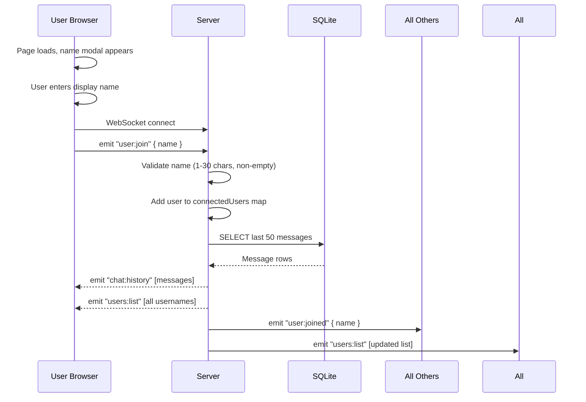
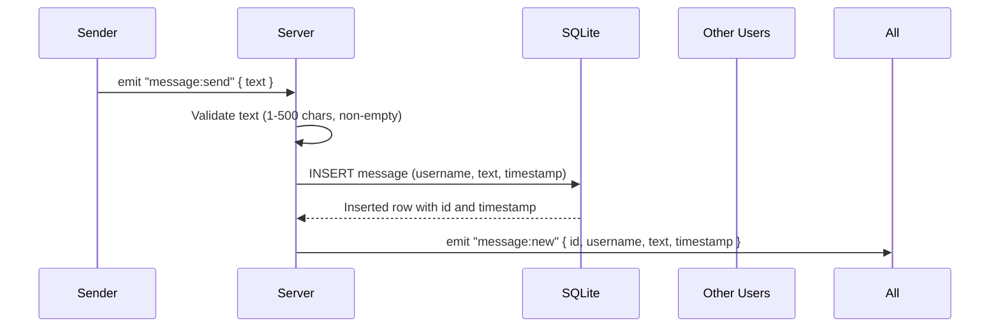
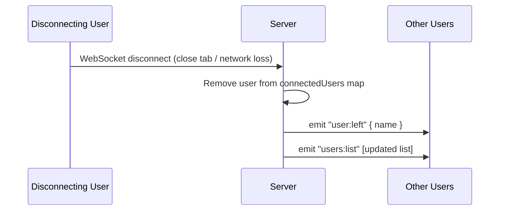

# Functional Specification

This document defines how the system behaves: the user interface, user flows, API surface, and data models. All items trace back to the [requirements specification](requirements.md).

---

## UI Wireframe

```
+----------------------------------------------------------+
|  Team Chat                               Online Users: 3  |
+----------------------------------------------------------+
|                              |                            |
|   Chat Messages              |   Online Users             |
|                              |                            |
|   [10:01] Alice: Hi team!   |   * Alice                  |
|   [10:02] Bob: Hey Alice!   |   * Bob                    |
|   [10:03] -- Charlie joined -|   * Charlie                |
|   [10:03] Charlie: Morning! |                            |
|                              |                            |
|                              |                            |
|                              |                            |
+----------------------------------------------------------+
|  [Type a message...                         ] [Send]      |
+----------------------------------------------------------+
```

**Components:**
- **Header** -- App title and online user count
- **Chat area** (left/main) -- Scrollable message list, auto-scrolls on new messages
- **User sidebar** (right) -- List of connected display names
- **Input area** (bottom) -- Text input and Send button
- **Name modal** (overlay) -- Shown on page load before chat is visible

---

## User Flows

### Join Flow



### Send Message Flow



### Disconnect Flow



---

## API / Event Specification

### REST Endpoints

| Method | Path | Response | Description | Traces To |
|--------|------|----------|-------------|-----------|
| GET | `/` | HTML | Serves the frontend application | -- |
| GET | `/health` | `{ status: "ok", uptime: <seconds> }` | Health check endpoint | NFR-04 |

### Socket.io Events: Client -> Server

| Event | Payload | Description | Traces To |
|-------|---------|-------------|-----------|
| `user:join` | `{ name: string }` | User requests to join with a display name | FR-01 |
| `message:send` | `{ text: string }` | User sends a chat message | FR-03 |

### Socket.io Events: Server -> Client

| Event | Payload | Description | Traces To |
|-------|---------|-------------|-----------|
| `chat:history` | `Message[]` | Last 50 messages, sent to joining user only | FR-06 |
| `message:new` | `Message` | New message broadcast to all connected users | FR-04 |
| `users:list` | `string[]` | Updated list of all online display names | FR-02 |
| `user:joined` | `{ name: string }` | Join notification broadcast to all users | FR-08 |
| `user:left` | `{ name: string }` | Leave notification broadcast to all users | FR-08 |

---

## Data Models

### Messages Table (SQLite)

```sql
CREATE TABLE IF NOT EXISTS messages (
    id        INTEGER PRIMARY KEY AUTOINCREMENT,
    username  TEXT    NOT NULL,
    text      TEXT    NOT NULL,
    timestamp DATETIME DEFAULT CURRENT_TIMESTAMP
);
```

### Message Object (returned by API)

```json
{
    "id": 1,
    "username": "Alice",
    "text": "Hello team!",
    "timestamp": "2026-03-11T14:30:00.000Z"
}
```

### Connected Users (in-memory, not persisted)

```
connectedUsers: Map<socketId, { name: string, joinedAt: Date }>
```

This map is held in server memory. It is rebuilt on server restart (all users reconnect).

---

## Validation Rules

| Field | Rule | Error Behavior |
|-------|------|---------------|
| Display name | 1-30 characters after trimming, non-empty | Server ignores the `user:join` event; client shows error |
| Message text | 1-500 characters after trimming, non-empty | Server ignores the `message:send` event; client shows error |
| Duplicate display names | Allowed | Simplicity per assumption A-04; users are distinguishable by their messages |

---

## System Notifications

System-generated messages appear in the chat area but are visually distinct (e.g., italic, muted color, no username):

- **"Alice joined the chat"** -- when a user connects
- **"Bob left the chat"** -- when a user disconnects

These are not stored in the database; they are transient events.
